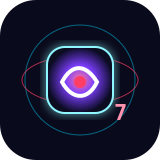

# Fabio7X AI

### Criador digital · desenvolvedor web · game maker · IA criativa

  
  
  
  
  
  
  

## // Converse com a IA

**NEXO-7** é a IA criativa da Fabio7X. Ela ajuda a transformar uma ideia em plano, texto, estratégia, projeto digital ou ponto de partida técnico. No GitHub ela aparece como um atalho visual; ao clicar, a conversa abre no ambiente hospedado e seguro.

| Você traz | NEXO-7 ajuda a criar | Acesso |
| --- | --- | --- |
| Uma ideia ou problema | caminhos, textos, estrutura e próximos passos | [Conversar agora](https://fabiodigi-pr7pfynb.manus.space/#nexo) |
| Um projeto digital | escopo, conteúdo e possibilidades de interface | [Abrir Fabio7X AI](https://fabiodigi-pr7pfynb.manus.space/) |

## // Quem está construindo

Sou **Fabio**, criador da marca **Fabio7X**. Transformo ideias em produtos digitais: sites, landing pages, experiências interativas, jogos para navegador e fluxos de IA. Meu foco é unir apresentação visual forte, utilidade e acesso simples pelo celular.

> **Se pode ser digital, eu construo.**

## // Entre no arcade

Meu perfil agora funciona como uma pequena sala de arcade. Os jogos rodam no [Fabio7X Hub](https://kasulajunio.github.io/), sem instalação, com suporte para celular e melhores pontuações salvas localmente no navegador.

| Mini jogo | Desafio | Acesso |
| --- | --- | --- |
| **Neon Reflex** | Clique no alvo luminoso o máximo de vezes em 15 segundos. | [Jogar agora](https://kasulajunio.github.io/#arcade) |
| **Pixel Dodge** | Desvie dos fragmentos usando teclado ou toque. | [Jogar agora](https://kasulajunio.github.io/#arcade) |
| **Memory Pulse** | Encontre os oito pares com o menor número de movimentos. | [Jogar agora](https://kasulajunio.github.io/#arcade) |
| **Mini Game Kit** | Três mecânicas em JavaScript puro para estudar, adaptar e publicar. | [Abrir a demo](https://kasulajunio.github.io/fabio7x-mini-game-kit/) |
| **NEXO Rift Runner** | Corrida 3D cyberpunk para celular: colete núcleos, evite drones e use impulso para atravessar a pista orbital. | [Jogar agora](https://kasulajunio.github.io/nexo-rift-runner.html) |

## // Projetos em destaque

| Projeto | O que é | Acesso |
| --- | --- | --- |
| **Fabio7X AI / NEXO-7** | Assistente criativo para conversar, estruturar ideias, escrever e planejar. | [Conversar com a IA](https://fabiodigi-pr7pfynb.manus.space/#nexo) |
| **F7X Digital** | Hub de serviços e soluções digitais para sites, marcas e projetos criativos. | [Entrar no estúdio](https://kasulajunio.github.io/f7x-digital/) |
| **Fabio7X IO Games** | Plataforma com jogos rápidos para jogar diretamente no navegador. | [Abrir a arena](https://kasulajunio.github.io/fabio7x-io-games/) |
| **Fabio7X Hub** | Página central com portfólio, arcade, experiências e novidades. | [Visitar o hub](https://kasulajunio.github.io/) |
| **Fabio7X Mini Game Kit** | Kit open source com Neon Reflex, Pixel Dodge e Memory Pulse. | [Ver demo e código](https://github.com/kasulajunio/fabio7x-mini-game-kit) |
| **NEXO Rift Runner** | Novo arcade 3D em navegador, criado para toque, teclado e compartilhamento por link. | [Entrar na pista](https://kasulajunio.github.io/nexo-rift-runner.html) |
| **go-tcg-storage** | Biblioteca open source em Go para comunicação com funções de armazenamento. | [Ver repositório](https://github.com/kasulajunio/go-tcg-storage) |

## // Stack e áreas

Construo com **HTML semântico, CSS moderno, JavaScript, canvas, GitHub Pages e Go**, explorando interfaces responsivas, jogos web, presença digital e experiências que funcionam bem no celular.

## // O que estou construindo

Estou ampliando o ecossistema Fabio7X com uma IA criativa, uma vitrine digital própria, serviços para pequenos projetos e uma coleção de jogos web. A prioridade é lançar experiências acessíveis, visuais e feitas para convidar as pessoas a interagir — não apenas olhar.

## // Vamos criar algo

 

<a href="https://kasulajunio.github.io/"><strong>Jogar no Fabio7X Arcade →</strong></a>

  

Fabio7X Digital · Porto Seguro, Bahia, Brasil

