# Fabio7X

### Criador digital · desenvolvedor web · game maker

  
  
  

## // Quem está construindo

Sou **Fabio**, criador da marca **Fabio7X**. Transformo ideias em produtos digitais: sites, landing pages, experiências interativas e jogos para navegador. Meu foco é unir uma apresentação visual forte a projetos simples de acessar, rápidos de testar e fáceis de entender.

> **Se pode ser digital, eu construo.**

## // Entre no arcade

Meu perfil agora funciona como uma pequena sala de arcade. Os jogos rodam no [Fabio7X Hub](https://kasulajunio.github.io/), sem instalação, com suporte para celular e melhores pontuações salvas localmente no navegador.

| Mini jogo | Desafio | Acesso |
| --- | --- | --- |
| **Neon Reflex** | Clique no alvo luminoso o máximo de vezes em 15 segundos. | [Jogar agora](https://kasulajunio.github.io/#arcade) |
| **Pixel Dodge** | Desvie dos fragmentos usando teclado ou toque. | [Jogar agora](https://kasulajunio.github.io/#arcade) |
| **Memory Pulse** | Encontre os oito pares com o menor número de movimentos. | [Jogar agora](https://kasulajunio.github.io/#arcade) |

## // Projetos em destaque

| Projeto | O que é | Acesso |
| --- | --- | --- |
| **F7X Digital** | Hub de serviços e soluções digitais para sites, marcas e projetos criativos. | [Entrar no estúdio](https://kasulajunio.github.io/f7x-digital/) |
| **Fabio7X IO Games** | Plataforma com jogos rápidos para jogar diretamente no navegador. | [Abrir a arena](https://kasulajunio.github.io/fabio7x-io-games/) |
| **Fabio7X Hub** | Página central com portfólio, arcade, experiências e novidades. | [Visitar o hub](https://kasulajunio.github.io/) |
| **go-tcg-storage** | Biblioteca open source em Go para comunicação com funções de armazenamento. | [Ver repositório](https://github.com/kasulajunio/go-tcg-storage) |

## // Stack e áreas

Construo com **HTML semântico, CSS moderno, JavaScript, canvas, GitHub Pages e Go**, explorando interfaces responsivas, jogos web, presença digital e experiências que funcionam bem no celular.

## // O que estou construindo

Estou ampliando o ecossistema Fabio7X com uma vitrine digital própria, serviços para pequenos projetos e uma coleção de jogos web. A prioridade é lançar experiências acessíveis, visualmente marcantes e que convidem as pessoas a interagir — não apenas olhar.

## // Vamos criar algo

 

<a href="https://kasulajunio.github.io/"><strong>Jogar no Fabio7X Arcade →</strong></a>

  

Fabio7X Digital · Porto Seguro, Bahia, Brasil

