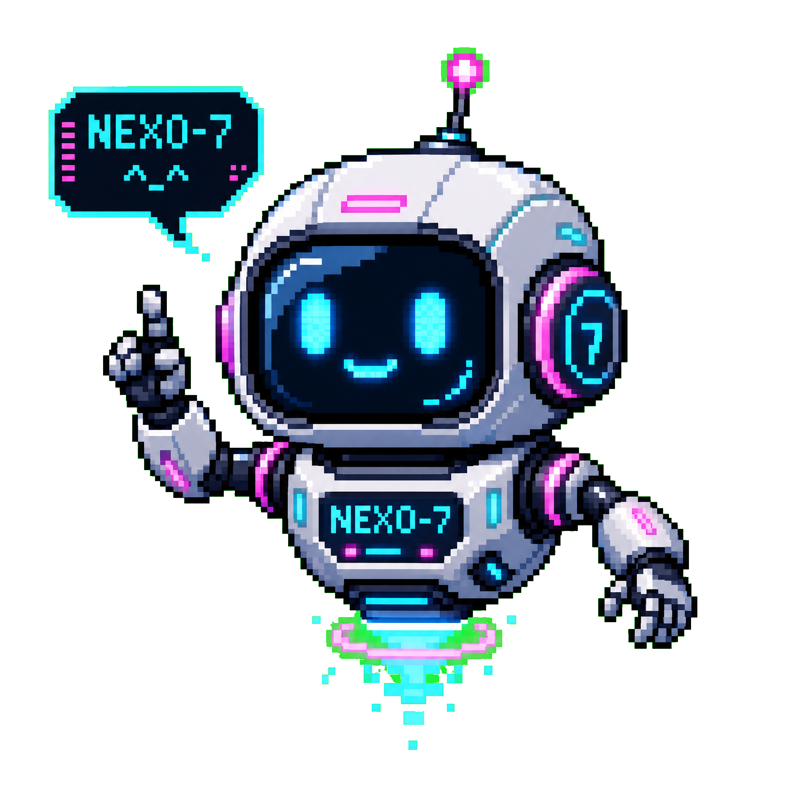
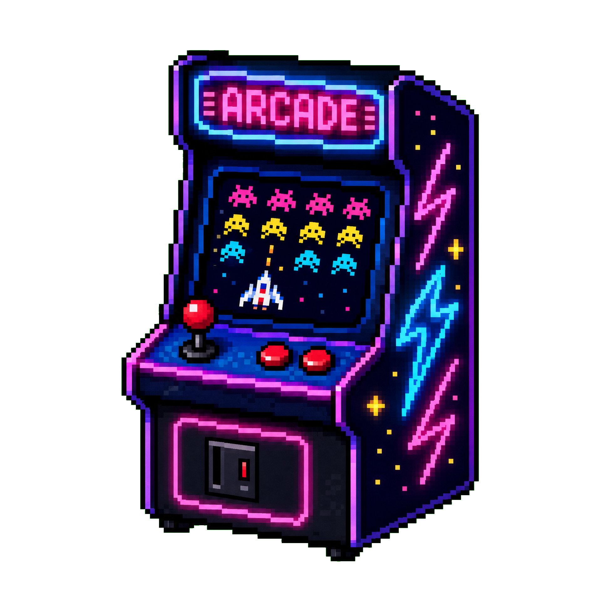

# 🕹️ Fabio7X AI
### Criador Digital · Desenvolvedor Web · Game Maker · IA Criativa

---

## 🤖 // NEXO-7: Sua IA Criativa

**NEXO-7** é a inteligência artificial da Fabio7X projetada para transformar ideias brutas em projetos digitais estruturados.
- **Estratégia:** Planos de ação e caminhos técnicos.
- **Criação:** Textos, roteiros e conceitos visuais.
- **Desenvolvimento:** Estrutura de código e lógica de interface.

[**Conversar com NEXO-7 agora →**](https://fabiodigi-pr7pfynb.manus.space/#nexo)

---

## 🎮 // Fabio7X Arcade

Transformo o navegador em uma sala de arcade. Experiências rápidas, leves e otimizadas para mobile.
- **Neon Reflex:** Teste seus reflexos em 15 segundos.
- **Pixel Dodge:** Sobrevivência em estética retro.
- **NEXO Rift Runner:** Corrida 3D cyberpunk.
- **Mini Game Kit:** Mecânicas open source para estudar e adaptar.

[**Explorar o Arcade →**](https://kasulajunio.github.io/#arcade)

---

## ✦ // Personalize seu mini jogo

**Fabio7X Mini Game Kit Custom** é uma personalização de uma mecânica de reflexo, desvio ou memória para projetos, eventos e portfólios. A edição de lançamento custa **R$ 149**, inclui identidade visual, tela inicial, placar local e uma rodada de ajustes. O Mini Game Kit open source e a demo continuam gratuitos.

[**Conhecer escopo, entrega e condições →**](https://kasulajunio.github.io/mini-game-kit-custom.html)

---

## 📊 // GitHub Stats & Activity

### 🐍 Contribution Snake

---

## 🛠️ // Tecnologias & Stack

---

## 📫 // Vamos criar algo incrível?

Fabio7X Digital · Porto Seguro, Bahia, Brasil

