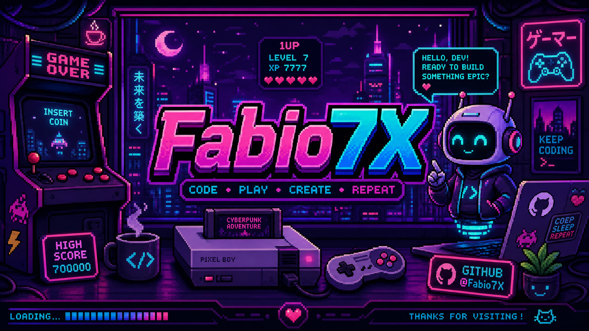

  

   

  

  <h1>FABIO7X AI</h1>
  
<strong>IA criativa · jogos de navegador · experiências digitais</strong>

  
  
  
  

    
  

> **Fabio7X** é um universo neon para criar, jogar e transformar ideias em experiências digitais. Tudo começa por uma rota simples: abrir a IA, testar um jogo ou explorar o código.

## COMEÇAR POR AQUI

| Quero… | Abrir | O que encontro |
| --- | --- | --- |
| Transformar uma ideia em projeto | [**NEXO-7 →**](https://fabiodigi-pr7pfynb.manus.space/#nexo) | Assistente de IA para estratégia, conteúdo, código e próximos passos. |
| Criar animações com código | [**MOTION//LAB →**](https://kasulajunio.github.io/terminal-animacoes/) | Terminal visual no navegador para escrever comandos e ver movimento no palco. |
| Jogar agora no navegador | [**Fabio7X Arcade →**](https://kasulajunio.github.io/#arcade) | Mini jogos gratuitos, mobile-first e compartilháveis. |
| Estudar mecânicas de jogos | [**Mini Game Kit →**](https://github.com/kasulajunio/fabio7x-mini-game-kit) | Código aberto para aprender, adaptar e criar. |
| Conhecer experiências web | [**F7X Digital →**](https://kasulajunio.github.io/f7x-digital/) | Landing pages, sites e projetos digitais. |

---

## DESTAQUES DO UNIVERSO

| Projeto | Status | Atalho |
| --- | --- | --- |
| **NEXO Rift Runner** | Corrida 3D cyberpunk com toque e teclado. | [Jogar grátis →](https://kasulajunio.github.io/nexo-rift-runner.html) |
| **NEXO Idea Sprint** | Um caminho guiado para sair da ideia parada. | [Experimentar →](https://fabiodigi-pr7pfynb.manus.space/#nexo) |
| **Neon Reflex & Pixel Dodge** | Desafios rápidos de reflexo e sobrevivência. | [Abrir jogos →](https://kasulajunio.github.io/#arcade) |

---

## MAPA DO PERFIL

| Área | Repositório | Função no universo |
| --- | --- | --- |
| **Hub público** | [kasulajunio.github.io](https://github.com/kasulajunio/kasulajunio.github.io) | Central para demos, Arcade e páginas públicas. |
| **Jogos** | [fabio7x-io-games](https://github.com/kasulajunio/fabio7x-io-games) | Coleção de jogos rápidos para navegador. |
| **Código aberto** | [fabio7x-mini-game-kit](https://github.com/kasulajunio/fabio7x-mini-game-kit) | Base para mecânicas neon e contribuições. |
| **Estúdio** | [f7x-digital](https://github.com/kasulajunio/f7x-digital) | Portfólio de experiências web e presença digital. |

<strong>Projetos sob medida — escopos aprovados</strong>

 

As demos e o código aberto continuam gratuitos. As opções abaixo têm escopo e condições já aprovados e permanecem apenas nos canais oficiais do GitHub.

| Projeto | Inclui | Investimento | Informações |
| --- | --- | ---: | --- |
| **Mini Game Kit Custom** | Identidade visual, tela inicial, placar local e uma rodada de ajustes. | **R$ 149** | [Escopo e condições →](https://kasulajunio.github.io/mini-game-kit-custom.html) |
| **Site Launch Lite** | Landing page mobile, identidade visual básica, CTA e uma rodada de ajustes. | **R$ 249** | [Escopo e condições →](https://kasulajunio.github.io/site-launch-lite.html) |

<strong>Stack e atividade</strong>

 

  
  
    
  

---

## SINAL EM MOVIMENTO

  

---

  
  
    
  Fabio7X Digital · Bahia, Brasil · construindo no ritmo do próximo rift.

