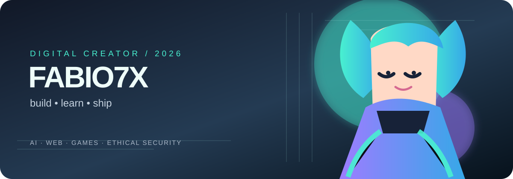

  

  # Fabio7X · Kasula

  **Criador de experiências digitais para celular, web e jogos.**

  <a href="https://kasulajunio.github.io/">Portfólio</a> ·
  <a href="https://github.com/kasulajunio?tab=repositories">Projetos</a> ·
  <a href="https://www.instagram.com/fabio_do_fut/">Instagram</a>

  
  

## O que eu construo

| Categoria | Direção | Projetos para começar |
| --- | --- | --- |
| ✦ **IA & automação** | Ferramentas que transformam uma ideia em próximo passo. | [NEXO-7 AI](https://github.com/kasulajunio/nexo7-ai) · [Fris AI Studio](https://github.com/kasulajunio/fris-ai-studio) |
| ◈ **Web & produtos** | Landing pages e experiências leves, pensadas primeiro para celular. | [F7X Digital](https://kasulajunio.github.io/f7x-digital/) · [Kasula Docs](https://github.com/kasulajunio/kasula-docs) |
| ◉ **Jogos** | Protótipos rápidos, arcades e sistemas para experiências interativas. | [Fabio7X Arcade](https://kasulajunio.github.io/#arcade) · [Arena Hub](https://github.com/kasulajunio/arena-hub) |
| 🛡 **Segurança ética** | Estudos defensivos, laboratórios e automação responsável. | [Laboratórios SQL seguros](https://github.com/kasulajunio/laboratorios-sql-seguros) · [Guia de hacking ético](https://github.com/kasulajunio/guia-hacking-etico) |

## Em destaque

| Projeto | O que é |
| --- | --- |
| **[Fris AI Studio](https://github.com/kasulajunio/fris-ai-studio)** | Estúdio de ferramentas criativas com IA e checkout Pix. |
| **[NEXO-7 AI](https://github.com/kasulajunio/nexo7-ai)** | Assistente para organizar ideias e próximos passos. |
| **[7X Fris Estúdio](https://kasulajunio.github.io/7x-fris-estudio/)** | Plataforma PWA de conteúdo e entretenimento. |
| **[Termux Dev Toolkit](https://github.com/kasulajunio/termux-dev-toolkit)** | Scripts em português para Termux e Linux. |

## Stack

  

<b>Mais projetos por categoria</b>

### Web, docs e recursos

- [Awesome Free Developer Tools](https://github.com/kasulajunio/awesome-free-developer-tools) — coleção de recursos gratuitos.
- [Kasula Docs](https://github.com/kasulajunio/kasula-docs) — documentação e guias.
- [F7X Site Express](https://github.com/kasulajunio/f7x-site-express) — experimento de site rápido.

### Jogos e experiências

- [Arena Hub](https://github.com/kasulajunio/arena-hub) — hub de experiências.
- [Lendas da Lua](https://github.com/kasulajunio/lendas-da-lua) — projeto de jogo.
- [Mini Game Kit](https://github.com/kasulajunio/fabio7x-mini-game-kit) — mecânicas reutilizáveis para jogos web.

### Segurança responsável

- [Guia de Hacking Ético](https://github.com/kasulajunio/guia-hacking-etico) — estudos autorizados e defensivos.
- [Laboratórios SQL Seguros](https://github.com/kasulajunio/laboratorios-sql-seguros) — prática em ambientes controlados.

## Agora

> Aprendendo em público, prototipando no celular e transformando ideias em coisas que as pessoas conseguem usar.

  <a href="mailto:julianajogado@gmail.com">✉ Falar comigo</a> · Bahia, Brasil

